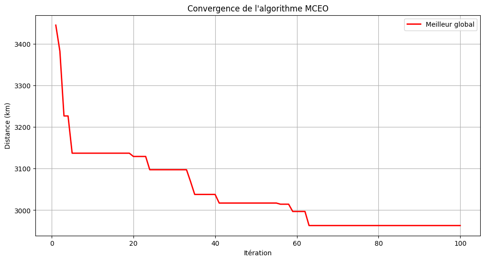

# Optimisation du TSP avec l'Algorithme MCEO

## 📌 Problème du Voyageur de Commerce (TSP)
Le TSP vise à trouver le plus court trajet pour visiter un ensemble de villes avant de revenir au point de départ. Notre étude porte sur 10 villes marocaines, avec des distances calculées à partir de leurs coordonnées GPS réelles.

## 🧠 Algorithme MCEO
Le Multi-Level Cross Entropy Optimizer est une méthode innovante qui :
- Utilise plusieurs centres de recherche simultanés
- Adapte automatiquement sa précision
- Évite de rester bloqué sur des solutions sous-optimales
- Paramètres : 7 centres de recherche, 25 solutions/itération, 100 itérations

## 📊 Résultats

### Performance de convergence

*Amélioration progressive de la solution - stabilisation après 63 itérations*

- **Distance initiale** : 3444 km
- **Distance optimale** : 2963 km (-14%)
- **Temps de calcul** : [préciser si disponible]

### Trajet optimal final

## ✅ Conclusion
L'algorithme MCEO a permis :
1. Une réduction de 14% de la distance totale
2. Une convergence stable en 63 itérations
3. Une solution visuellement cohérente

**Applications potentielles** : optimisation de tournées de livraison, planification de circuits touristiques, organisation de collectes urbaines.
